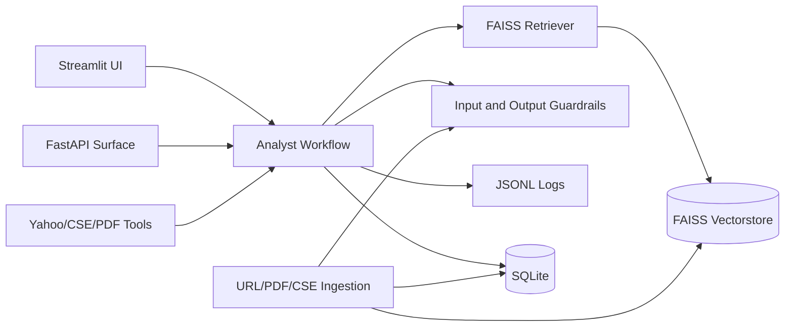

# Architecture

## Overview

CSE Market Intelligence is a Streamlit-first analyst workstation backed by a production-style agent workflow. The system combines CSE announcements, company reports, market data, structured extraction, vector retrieval, guardrails, SQLite persistence, and observability.

## Component Map

## Agent Workflow

1. Intake router records company, ticker, mode, and query-risk state.
2. Prompt-injection guardrail blocks high-risk prompt/secret extraction requests.
3. Research planner prepares a retrieval-first execution path.
4. RAG synthesis retrieves evidence and produces the five-section analyst answer.
5. Evidence evaluator scores source count, diversity, chunk count, and warnings.
6. Grounding critic blocks or downgrades weakly supported answers.
7. Output validator checks required sections and direct advice language.
8. Observability logger stores trace, metrics, guardrails, and validation results.

## Storage Split

SQLite stores document metadata, chunk metadata, agent runs, critic outcomes, validation results, and source summaries. FAISS stores semantic vectors for retrieval. JSONL logs remain as a simple fallback and audit trail.

## Guardrails

URL ingestion blocks unsupported schemes, embedded credentials, and local/private/reserved network targets. Analyst queries are screened for prompt-injection intent. Retrieved context is treated as untrusted evidence, not instructions. Final answers are checked for required structure and risky investment-advice language.
